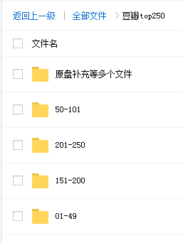
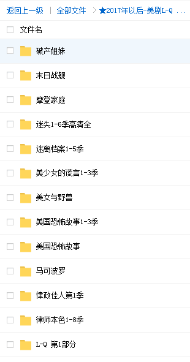

# 资源分类

<b>

一、主流付费平台
</b>

## 资源目录

实际内容比目录多
http://note.youdao.com/noteshare?id=7fd10758621338e782c6af98f48a7659

目录可以搜到的资源(搜索方法上面链接有详解)，有偿分享！支持试听试看，非诚勿扰！

## 收费标准（可自行对比TaoBao同类资源价格）

#### 套餐一：单个平台 10 元/永久

单个平台是指比如像'混沌大学'，10 元包含目录里看到的所有'混沌大学'平台课程，付费后邀你加入[单平台学习群](https://github.com/Daily-Github/VIP-knowledge/blob/master/img/tc02.png)。

#### 套餐二：全网 vip 会员 50 元/永久

内容包含：目录上看到的所有平台课程，两千多个栏目，100 万价值课程，加后期每天更新，每周上新 6 到 7 个新栏目。平台随便一个栏目就 200 元，现只需 50 元加入[全网 vip 会员共享学习群](https://github.com/Daily-Github/VIP-knowledge/blob/master/img/tc03.png)，永久免费更新！后期课程资源每更新增加 3000G 针对后加入会员涨价 10 元 ，入会 60 元、70 元以此类推，前面会员一次加入永久免费更新，早加入早受益，时间就是金钱，效率就是生命，不要等到价格上涨了说之前咨询价，一律按阶段价。

<b>

二、电影 & 美剧
</b>

## 收费标准：10 元/永久 （全网vip会员免费）

电影如图：

美剧如图：

# 更新日志

* 2020-01-19 主流付费平台，[新增慕课网课程](https://github.com/Daily-Github/VIP-knowledge/blob/master/img/慕课网.jpg)，全网vip会员请查收
* 2020-02-20 主流付费平台，下架单课程购买套餐，新增电影美剧分类

# 联系我们

我的微信：**qilei1584284030**
添加请备注：**获取付费资源**

否则不予以通过！！！

